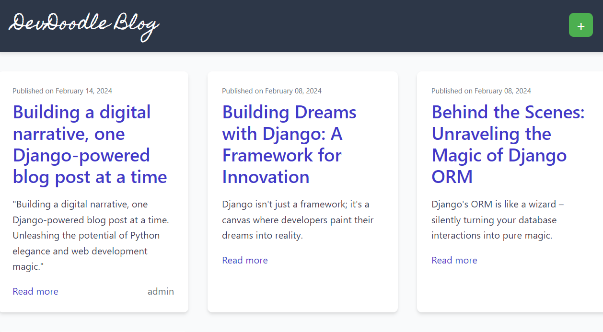

# DevDoodle - A Blog Webapp

## Table of Contents
- [Description](#description)
- [Key Features](#key-features)
- [Installation](#installation)

## Description

The DevDoodle Blog is a web application designed for developers and tech enthusiasts to share, explore, and engage in tech-related content. With a focus on simplicity and visual appeal, this blog provides an intuitive platform for users to create, edit, and discover posts without the need for authentication. Dive into the world of technology, express your thoughts, and connect with like-minded individuals through the DevDoodle Blog.




## Key Features

1. **Simplified User Experience:**
   - No authentication required for seamless access.
   - Intuitive and user-friendly design.

2. **Visually Appealing Interface:**
   - Elegant post cards with shadows and hover effects.
   - Captivating header styling with a unique font and color scheme.
   - Thoughtfully selected typography for readability.

3. **Clean and Uncluttered Layout:**
   - Ample whitespace for a clean and organized appearance.
   - Adjusted margins and paddings for improved spacing between elements.

4. **Tech-Centric Content:**
   - Users can create, edit, and explore tech-related posts.
   - Dynamic post index for easy navigation.

5. **Responsive Design:**
   - Ensures a seamless experience across various devices.

## Installation
To run the DevDoodle Blog locally, follow these steps:

##  Clone the Repository

```bash
git clone https://github.com/SHIV000000/DevDoodle.git
```
```bash
cd DevDoodle
```
## Create a virtual environment:

### On Macos\Linux:
```bash
python3 -m venv venv
 ```
### On Windows:
```bash
py -m venv venv
```
## Activate  virtual environment:

### On Macos\Linux:
```bash
source venv/bin/activate
```

### On Windows:
```bash
venv\Scripts\activate
```


## Install Dependencies:

```bash
pip install django
```
## Apply Migrations:

```bash
python manage.py makemigrations
```

```bash
python manage.py migrate
```
## Create Superuser (Optional)

 ```bash
python manage.py createsuperuser
```
## Run the Development Server

```bash
python manage.py runserver
```

Visit http://127.0.0.1:8000/ in your browser.
## Contributing

We welcome contributions from the community! If you'd like to contribute to this project, please follow these guidelines:

- **Reporting Issues**: If you encounter any bugs or issues, please open an issue on GitHub and provide as much detail as possible.
- **Feature Requests**: If you have any ideas for new features, feel free to open an issue to discuss them.
- **Code Contributions**: If you'd like to contribute code, please fork the repository, make your changes, and submit a pull request. Make sure your code follows our coding standards and include tests if applicable.

### Example Contribution

To contribute a new feature or fix a bug:

1. Fork the repository.
2. Create a new branch for your feature or fix: `git checkout -b feature-name`
3. Make your changes and commit them: `git commit -am 'Added new feature'`
4. Push your changes to your fork: `git push origin feature-name`
5. Open a pull request on GitHub.

We'll review your changes and merge them into the main branch once they've been approved.

##### Thank you for contributing to our project!

